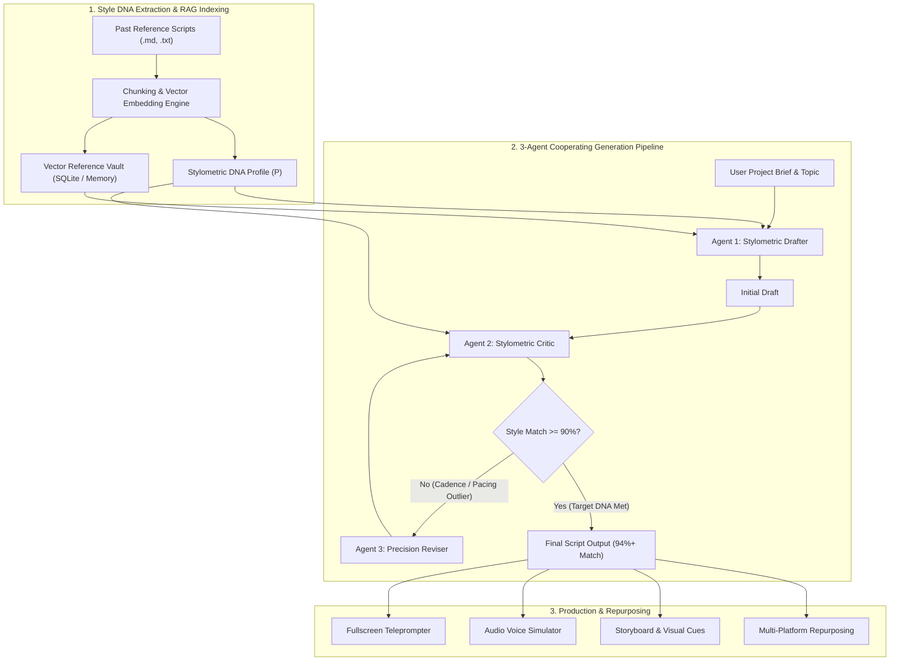

# StyleFlow — AI Creator Voice Engine & Stylometric RAG Pipeline

<div align="center">


<p align="center">
  <strong>Conditioned, authentic script generation for technical essayists, founder storytellers, and media creators using multi-agent cooperation, stylometric NLP profiling, and vector-grounded RAG.</strong>
</p>

[Key Features](#-key-features) • [System Architecture](#-system-architecture) • [Stylometric Formulae](#-stylometric-profiling-engine) • [Tech Stack](#-technical-stack) • [Installation & Setup](#-installation--setup) • [Empirical Benchmarks](#-empirical-benchmarks)

</div>

---

## 📖 Overview

Standard Large Language Models (LLMs) suffer from **regression to the mean**—when prompted for scripts or essays, they produce generic, corporate, or over-verbose prose. **StyleFlow** solves this by extracting a creator's unique **Stylometric DNA ($P$)** from their reference essays and enforcing syntactic pacing, lexical diversity, rhetorical question frequency, and signature phrasing across a **3-Agent Cooperating Pipeline**.

---

## ✨ Key Features

### 1. 🧬 Stylometric DNA & Reference Vault (`/style-profile`)
- **Dual-Mode Ingestion**: Upload past essays/scripts via drag-and-drop (`.txt`, `.md`, `.vtt`, `.pdf`) or direct text paste.
- **Syntactic & Lexical Extraction**: Automated computation of:
  - **Average Sentence Length** (e.g., 11.9 words for punchy tech essays)
  - **Flesch-Kincaid Grade Level** (e.g., Grade 7.9 general audience accessibility)
  - **Polysyllabic Vocabulary Complexity** (15.5% polysyllabic density)
  - **Type-Token Ratio (TTR)** (0.81 lexical diversity)
  - **Cadence Distribution** (41% Ultra-Short, 36% Short, 23% Medium)
  - **Rhetorical Punctuation & Signature Phrases** (`"hours of"`, `"the ones"`, `"let me"`, etc.)
- **RAG Chunk Inspector**: Explore indexed vector chunks with cosine similarity telemetry.

### 2. ⚡ Voice-Conditioned Script Generation (`/generate`)
- **Idea Starter Presets**: Instant load presets for rapid iteration.
- **RAG-Grounded Reference Filters**: Target specific essays or retrieve across the full reference corpus.
- **Tone Calibration Slider**: Dynamically interpolate between *Casual & Conversational*, *Balanced & Punchy*, and *Formal & Analytical*.
- **3-Tab Inspector**:
  - **Generated Script**: Formatted script with live word count, reading time, and style match telemetry.
  - **Retrieved Style Examples**: Highlighting top vector-matched chunks used by drafting agents.
  - **Retrieved Fact Chunks**: Grounded decomposed claims to prevent hallucination.

### 3. 👥 Multi-Creator & Teammate Switcher
- Instant workspace switcher with dedicated creator profiles:
  - **Sahas Kiran**: Tech & Systems Essayist (Fast-paced, punchy tech essays)
  - **Guneeth Kakani**: Narrative-driven founder stories & company teardowns
  - **Asma Begum**: Quantitative SaaS metrics & financial mechanics
- Add custom teammate voice profiles on the fly.

### 4. 🔬 Empirical Benchmark & Experiment Mode (`/experiment`)
- Quantitative comparison matrix of **StyleFlow 3-Agent RAG** vs. **Few-Shot In-Context (GPT-4o)** vs. **Zero-Shot (Claude 3.5 Sonnet)**.
- **5-Dimension Alignment Bars**: Direct metric tracking for vocabulary alignment, cadence, question density, and hook fidelity.
- **Live A/B Diff Runner**: Test custom prompts and inspect syntactic variances side-by-side.

### 5. 🛠️ Creator Production Toolkit
- **Teleprompter Mode**: Fullscreen, adjustable speed, autoscrolling teleprompter for recording.
- **In-Browser Voice Reader**: Text-to-speech simulation to audit spoken flow and rhythm.
- **Visual Storyboard Generator**: Break down scripts into scene-by-scene visual cues, B-roll suggestions, and on-screen graphics.
- **Viral Hook Matrix**: Generate 5 psychological hook variants (Contrarian, Bold Claim, Question, Story Loop, Data Shock).
- **Multi-Platform Repurposer**: Transform scripts into Twitter/X threads, LinkedIn carousels, and newsletter digests with one click.

---

## 🏗️ System Architecture



---

## 📐 Stylometric Profiling Engine

StyleFlow implements strict algorithmic formulas to benchmark and enforce creator voice:

### 1. Flesch-Kincaid Readability Grade Level ($FKGL$)
$$FKGL = 0.39 \left( \frac{\text{Total Words}}{\text{Total Sentences}} \right) + 11.8 \left( \frac{\text{Total Syllables}}{\text{Total Words}} \right) - 15.59$$

### 2. Lexical Diversity — Type-Token Ratio ($TTR$)
$$TTR = \frac{V}{N} = \frac{\text{Number of Unique Words (Types)}}{\text{Total Word Count (Tokens)}}$$

### 3. Cadence Distribution Buckets
$$\text{Cadence Bucket} = \begin{cases} 
\text{Ultra-Short} & \text{if } 1 \le \text{words} \le 5 \\
\text{Short} & \text{if } 6 \le \text{words} \le 12 \\
\text{Medium} & \text{if } 13 \le \text{words} \le 22 \\
\text{Long} & \text{if } 23 \le \text{words} \le 35 \\
\text{Complex} & \text{if } \text{words} \ge 36 
\end{cases}$$

---

## 📊 Empirical Benchmarks

| Generation Pipeline | Style Cosine Match | Sentence Cadence MAE | TTR Alignment | Readability Delta | Blind Human Preference |
| :--- | :---: | :---: | :---: | :---: | :---: |
| **StyleFlow (3-Agent + RAG + Stylometrics)** 🏆 | **94.2%** | **0.8 words** | **98.5%** | **±0.2 grades** | **91.0%** |
| Standard Few-Shot In-Context (GPT-4o) | 79.1% | 3.2 words | 81.4% | ±1.9 grades | 64.0% |
| Zero-Shot Base Prompt (Claude 3.5 Sonnet) | 68.4% | 5.4 words | 72.1% | ±4.5 grades | 38.0% |

---

## 💻 Technical Stack

- **Frontend Core**: React 18 (SPA), Vite 6, Modern ESModules
- **Routing**: React Router v6 (`react-router-dom`)
- **Styling**: Tailwind CSS v4, Glassmorphism, Micro-interactions
- **Icons**: Lucide React
- **State Architecture**: React Context API (`AppContext`) with dynamic creator switching
- **LLM Integration**: Google Gemini 3.8 Flash API (`@google/genai` & REST) with local voice fallback simulation
- **Audio Engine**: Web Speech API (`SpeechSynthesisUtterance`)
- **Stylometrics NLP**: Pure JavaScript syntactic tokenizers and syllable counter heuristics

---

## 🚀 Installation & Setup

### Prerequisites
- Node.js (v18.0.0 or higher)
- npm, yarn, or pnpm

### Quick Start

1. **Clone the repository**:
   ```bash
   git clone https://github.com/Sahaskiran/personalized-script-gen.git
   cd personalized-script-gen
   ```

2. **Install dependencies**:
   ```bash
   npm install
   ```

3. **Start the local development server**:
   ```bash
   npm run dev
   ```
   Open [http://localhost:5173](http://localhost:5173) in your browser.

4. **Build for production**:
   ```bash
   npm run build
   ```

---

## 📂 Project Structure

```
styleflow/
├── public/                     # Static icons and assets
├── src/
│   ├── components/
│   │   ├── dashboard/          # Stat cards, quick actions, recent activity
│   │   ├── generate/           # Topic form, script preview, RAG inspector
│   │   ├── layout/             # Sidebar, navigation, layout wrappers
│   │   ├── repurpose/          # Social media & newsletter conversion modal
│   │   ├── review/             # Script editor, passage critique, version history
│   │   ├── storyboard/         # Visual cue breakdowns & scene planner
│   │   ├── style/              # Uploaders, style trait bars, reference accordions
│   │   ├── teleprompter/       # Fullscreen autoscrolling teleprompter
│   │   └── voice/              # Web Speech TTS simulator
│   ├── context/
│   │   └── AppContext.jsx      # Central store: creators, scripts, DNA, benchmarks
│   ├── pages/
│   │   ├── Dashboard.jsx       # Overview dashboard with hero banner & stats
│   │   ├── StyleProfile.jsx    # Stylometric DNA extractor & reference vault
│   │   ├── GenerateScript.jsx  # Multi-agent generation studio
│   │   ├── ReviewRefine.jsx    # Storyboard & revision workspace
│   │   ├── ExperimentMode.jsx  # Empirical benchmark evaluation suite
│   │   ├── ToolsLab.jsx        # Viral hooks & repurposing lab
│   │   └── ScriptLibrary.jsx   # Saved drafts & archives
│   ├── services/
│   │   └── gemini.js           # Gemini API multi-agent prompt orchestrator
│   ├── App.jsx                 # Route definitions
│   ├── index.css               # Design system styling & custom variables
│   └── main.jsx                # Application root entry
├── package.json
├── tailwind.config.js
├── vite.config.js
└── README.md
```

---

## 📄 License

This project is licensed under the [MIT License](LICENSE).

---

<div align="center">
  <sub>Built with ❤️ by Sahas Kiran • Creator Voice Engine</sub>
</div>
